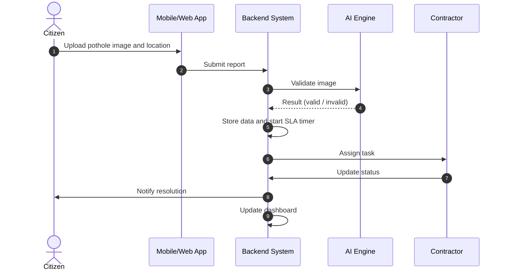
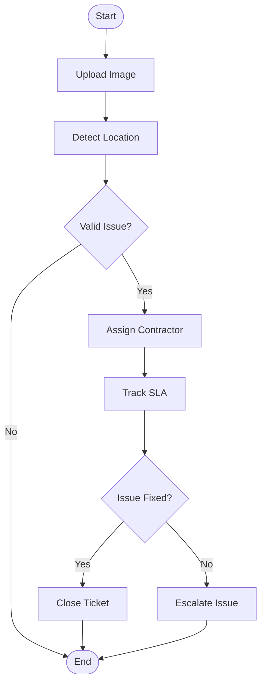

🚧 Smart City Pothole Reporting & Management System

> **Business Analysis + Product + Data-Driven Infrastructure**
> A comprehensive system designed to improve urban infrastructure by enabling citizens to report potholes and authorities to resolve them efficiently using SLA tracking and analytics.

---

## 📌 Problem Statement
*   ❌ **No centralized reporting system**: Fragmented ways to report road issues.
*   ⏳ **Delayed issue resolution**: Lack of tracking leads to long wait times.
*   🙈 **Lack of transparency**: Citizens and admins have no visibility into repair status.
*   📉 **No data-driven prioritization**: Hard to identify high-impact repair areas.

---

## 🎯 Objectives
- [x] **Enable real-time reporting**: Simplified image and GPS-based reporting.
- [x] **Ensure SLA compliance**: Resolution within 48 hours.
- [x] **Provide actionable insights**: Real-time dashboards for authorities.
- [x] **Improve operational efficiency**: Automated contractor assignment.

---

## 🏗️ System Architecture
```mermaid
flowchart LR
    A[Citizen App / Web] --> B[Frontend UI]
    B --> C[Backend API (Flask / FastAPI)]
    C --> D[Database (PostgreSQL / MySQL)]
    C --> E[ML Model - Pothole Detection]
    C --> F[Contractor Assignment Module]
    D --> G[Analytics Dashboard (Power BI / Streamlit)]
    G --> H[Admin Panel]
    F --> I[Contractor]
    I --> C
```

---

## 🔄 Workflow Interaction (Sequence)

---

## 🔁 Lifecycle Flowchart


---

## ⚙️ Requirements
### Functional Requirements (FRD)
- ✅ **Image Upload**: Users can capture and upload pothole photos.
- ✅ **Auto-Detection**: Automatic extraction of GPS coordinates.
- ✅ **Automated Dispatch**: System assigns tasks to the nearest contractor.
- ✅ **Status Tracking**: Real-time updates on repair progress.
- ✅ **Admin Dashboard**: Visual overview of city-wide road health.

### ⚡ Non-Functional Requirements
- ⏱️ **Performance**: API response time < 2 seconds.
- 📈 **Availability**: 99% system uptime.
- 🔒 **Security**: End-to-end encrypted user data.
- 📊 **Scalability**: Capable of handling thousands of reports simultaneously.

---

## ⏳ SLA (Service Level Agreement)
| Activity | Target Time | Action on Breach |
| :--- | :--- | :--- |
| **Assignment** | 2 Hours | Re-assign to standby contractor |
| **Resolution** | 48 Hours | Immediate escalation to Regional Head |
| **Escalation** | Post 48 Hours | Monthly penalty to contractor |

---

## 📊 KPIs (Key Performance Indicators)
- 🚀 **Resolution Rate**: Percentage of potholes fixed vs reported.
- ✅ **SLA Compliance**: % of issues resolved within 48 hours.
- ⏱️ **Avg Resolution Time**: Mean time from report to closure.
- 📍 **Area Density**: Heatmap of pothole concentrations.

---

## 🧠 Key Terms
- **BRD**: Business Requirement Document
- **FRD**: Functional Requirement Document
- **SLA**: Service Level Agreement
- **KPI**: Key Performance Indicator
- **GIS**: Geographic Information System (Mapping)

---

## 📦 Project Structure
```text
📁 pothole-system
 ┣ 📁 frontend       # User interface (React)
 ┣ 📁 backend        # Logic & APIs (Python)
 ┣ 📁 database       # Schema & Migrations
 ┣ 📁 ml-model       # Pothole detection scripts
 ┣ 📁 dashboard      # Admin visualization
 ┣ 📄 README.md      # Project documentation
 ┗ 📄 BRD_FRD.pdf    # Business/Functional Docs
```

---

## 📌 Conclusion
This system enhances urban governance by integrating citizen participation, analytics, and automation—ensuring faster resolution, transparency, and smarter city management.

## ⭐ Future Scope
- 🌐 **Smart City APIs**: Integration with traffic management systems.
- 📱 **Mobile Native**: Dedicated iOS/Android apps with offline support.

---
