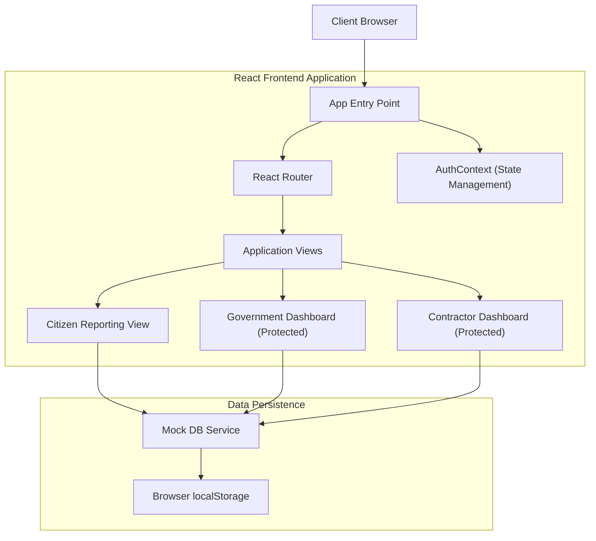
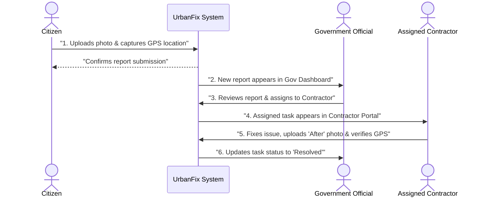
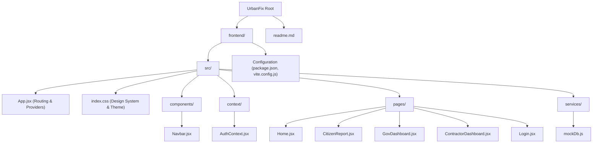

# UrbanFix - Infrastructure Issue Management System

UrbanFix is a comprehensive frontend application designed to streamline the process of reporting, assigning, and resolving civic infrastructure issues, such as potholes. Built with React and Vite, the platform features a highly dynamic, glassmorphism-inspired design.

It provides three distinct portals:
1. **Citizen Portal (Public)**: For users to report issues by uploading photos and automatically capturing their precise GPS location.
2. **Government Dashboard (Protected)**: For city officials to review reported issues and dispatch tasks to specific contractors.
3. **Contractor Portal (Protected)**: For assigned workers to view their tasks, navigate to the site, and upload resolution proof to close out the task.

---

## 🏛️ System Architecture

The current architecture utilizes a mock database running in the browser's `localStorage` to simulate a full end-to-end flow without requiring a backend server.



---

## 🔄 User Workflow

The application supports a complete lifecycle from the moment a pothole is spotted to the moment it is repaired and verified.



---

## 📁 Project Structure

The project has been organized into a dedicated `frontend` directory to support future full-stack expansion.



---

## 🚀 Getting Started

### Prerequisites
- Node.js installed on your machine.

### Installation & Execution

1. Open your terminal and navigate to the `frontend` directory:
   ```bash
   cd frontend
   ```
2. Install the dependencies:
   ```bash
   npm install
   ```
3. Start the development server:
   ```bash
   npm run dev
   ```

### Default Mock Logins
To test the protected portals, use the Login page. 
- **Government Official**: Select the "Government Official" role.
- **Contractor**: Select the "Contractor" role.
- *(No password required for this demo phase).*
